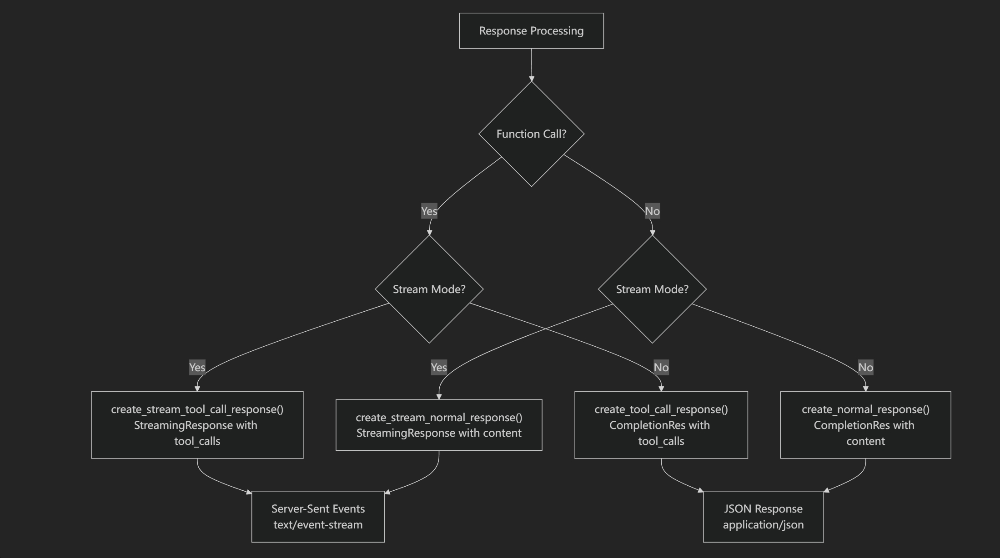

## Overview
ChatBridge is a simple framework for creating APIs that integrate with various AI models, allowing you to convert requests and responses into the OpenAI-compatible format, even for models that do not natively support function calls.

## Setup
cp .env .env_example

Then modify the fields in the .env file as needed.

```bash
git clone https://github.com/cnitlrt/ChatBridge
cd ChatBridge
git submodule update --init --recursive
uv venv --python 3.12
uv pip install -e .
cd Turnstile-Solver
uv pip install -r requirements.txt
uv run api_solver.py --browser_type camoufox --headless True --host 0.0.0.0
```

## Usage
### completions
```python
from chatbridge import *
@app.post("/v1/chat/completions")
@chatCompletions(build_all_prompt=1)
# For 2api websites, sometimes continuous conversation is not supported, so if build_all_prompt == 1, all messages need to be concatenated into one prompt
def retool(prompt: str, new_session: bool = False, model: str = "gpt-4o"):
    """
    some code
    """
    return content

def main():
    uvicorn.run("retool2api:app", host="0.0.0.0", port=10001, reload=True)

if __name__ == "__main__":
    main()
```
In this setup, the chatCompletions decorator automatically processes the request and converts it into the OpenAI format. You only need to ensure that the content returned by retool is a string, and it should represent the LLM's content. For example:
```
How can I assist you today?
```

### models
```python
@app.get("/v1/models")
@get_model_list
def get_models():
    model_ids = [
        ("gpt-4o", "openAI"),
        ("o3", "anthropic"),
        ("o3-mini", "anthropic"),
        ("gpt-4.1", "openAI"),
        ("gpt-4.1-mini", "openAI"),
        ("gpt-4o-mini", "openAI"),
        ("claude-opus-4-20250514", "anthropic"),
        ("claude-sonnect-4-20250514", "anthropic"),
        ("claude-3-5-haiku-20241022", "anthropic"),
        ("deepseek-v3", "ossProvider"),
    ]
    return model_ids
```
Make sure to replace the model_ids list with your desired models.


## Example
[retool2api.py](retool2api.py)

[tenbin2api.py](tenbin2api.py)

[gpt4vnet2api.py](tenbin2api.py)

[sophnet2api.py](tenbin2api.py)

## Deepwiki
